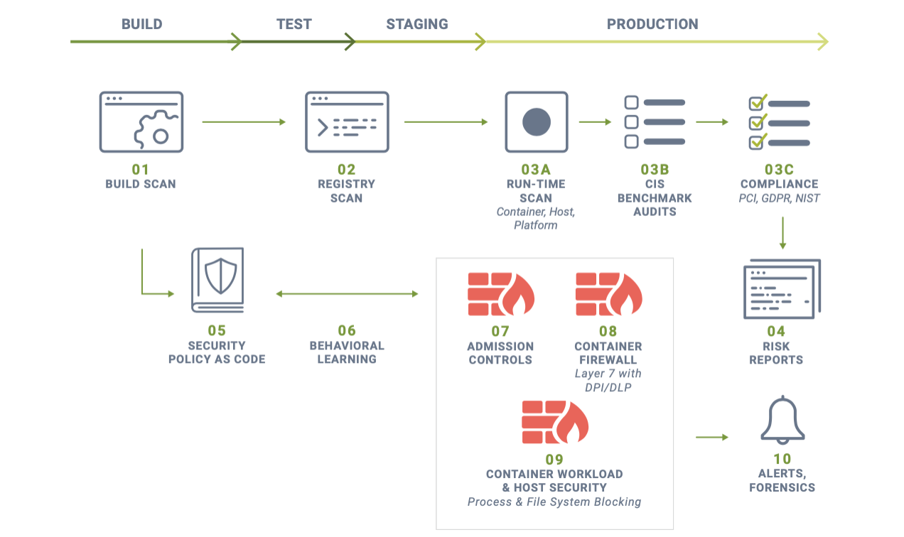
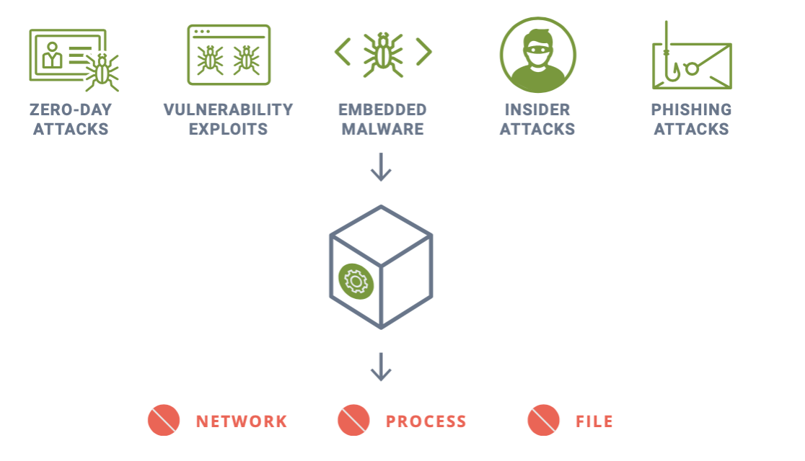

# TenStepstoAutomateContainerSecurity-Pt1

# AutomateContainerSecurityDevPOV
Automating Container Security Into the CI/CD Pipeline - DEVOPS Point of View

## Introduction

Welcome to Part 1 of automating Container security into the CI/CD Pipeline targeted at the DevOps role. This is first part of a 2 part series.  If you haven't checked out the Summary Blog of 10 Steps **will add link** to Automating Container Security into the CI/CD Pipeline, please check it out before reading this article. 

You will learn about the integration points that guide a DevOp through container security.  While containers using Kubernetes or Docker are nothing new, not all DevOps may know how to design and build these types of images that ensure container security. The flexibility of containers creates security challenges for developers. If you or your team is ulitizing software containers, you’ll want to learn about automating the process for ensuring best security practices.

DevOps are rapidly becoming experts on automated CI/CD pipelines and how to manage orchestration tools such as Kubernetes, they they often lack the understanding and experience of security technologies and best practices in production environments required to fend off the constant attacks on the infrastructure and applications.

## Integration Points that DevOps should consider as a guide to automating container security

The following 4 steps are typically the responsibility of the DevOp (which includes DevSecOps) and Compliance teams. These are steps that occur earlier in the pipeline

* **Build-Phase Scanning**

Container images should be scanned for vulnerabilities and compliance violations during the build phase so the build step can be stopped (failed) in order to force correction or remediation. Integration is made easy through plug-ins and extensions for popular tools such as Jenkins, CircleCI, Azure DevOps, Gitlab, Bamboo etc.

* **Registry Scanning**

After images pass build-phase scanning, they are staged into registries and should also be scanned there. New vulnerabilities can be discovered or introduced after images are pushed to registries. Registry scan results can also be linked to Admission Controls (see #7 below) to prevent unauthorized or vulnerable images from being deployed.

* **Production Scanning, CIS Benchmarks & Compliance Auditing**

Scanning and auditing should extend into the staging and production environments with run-time vulnerability scans and running of CIS benchmarks for Kubernetes and Docker, as well as any custom compliance checks.

* **Risk Reporting and Vulnerability Management**

Although addressing high risk environments and interpreting vulnerability management reports typically involve some manual review, alerting and correlation can be done

## End to End Vulnerability and Compliance Management

### End-to-End vulnerability management should follow the Assess, Prioritize, Act and Improve workflow as shown below

### Key Automation Steps in the CI/CD pipeline include: 

1. **Build-Phase Vulnerability Scan Triggers**

A. Use plug-ins, extensions, or REST API’s to enforce scanning during image builds to catch vulnerable images early in the pipeline. For example, NeuVector provides a Jenkins plug-in, CircleCI ORB, Azure DevOps extensions, REST API and other ways to force build-phase scans. Images can also be annotated with the developer or team responsible to make alerting or reporting easier.

B. Alerts for critical vulnerabilities discovered should go to the compliance management team and potentially the developer responsible for the image. These can be filtered to only alert and fail the build if there is a fix available for the vulnerability. If the image is annotated with the developer name alerting becomes easier and more accurate. See the section below on Virtual Patching for an overview of how to handle vulnerabilities with no fix available that must be allowed to exist in production.

2. **Automated Registry Scans**

A. Continuously monitor images in each registry being used for staging and production environments. Layered scan results can make it easier for developers to find the vulnerable package or library by examining the build commands for each layer. Images can also be annotated with the developer or team responsible to make alerting or reporting easier.

B. Alerts can be handled similarly to build-phase scans where only critical vulnerabilities with fixes available are sent to developers for remediation. If the image is annotated with the developer name alerting becomes easier and more accurate. While analyzing and alerting should be automated, some manual processes may be required initially until integration is tested and completed.

3. **Run-time (Production) Scanning & Auditing**

A. Auto-scan all running containers, hosts, and orchestrators. Any new containers, scaled up nodes, or updated orchestrator versions should be immediately scanned.

B. Run CIS-benchmarks and custom compliance checks continuously.

C. Enforce industry compliance requirements such as firewall and segmentation for PCI and other privacy standards. See the sections later in
this document on Security Policy as Code, Behavioral Learning, and Network Segmentation for ways to automate compliance for network firewall enforcement.

D. Alerts for critical run-time vulnerabilities with fixes available as
well as certain CIS benchmarks such as containers running as root should be sent to the DevOps team for investigation.

4. **Analyze, Triage and Correlate the *Impact* of Vulnerabilities in Production**

A. Correlate vulnerabilities to images, containers, hosts. Assess which production assets are affected by critical vulnerability and compliance issues.

B. Implement ‘Virtual Patching’ to mitigate production risks.

C. Alerts on unprotected assets with critical vulnerabilities should be sent to DevOps and security teams. Assets which have virtual patching applied can be downgraded or lowered in priority because they present a lower exploit risk.

## What is Virtual Patching

Virtual Patching enables security teams to ‘virtually patch’ a vulnerability in a running container or host, without needing to update or replace the running asset with a patched version. It essentially protects the running asset (container, host etc.) against an attempted exploit of the vulnerability.

The best way to do this is to automatically characterize and whitelist all application container behavior such as network connections, processes, and file activity, then lock it down. The workload or host are then ‘virtually patched,’ and any attempted exploit will create an unauthorized network connection, process, or file access which can be blocked.

Virtual patching protects against vulnerability exploits, embedded malware, zero-day attacks, and insider & phishing attacks.

Continue to learn more about how to automate Container Security  with respect to the Ops role in Part 2 of this article series.  We will preface it with the *bridge* that occurs between the CI/CD pipeline and the production environment with Security Policy as Code and Admission Controls being managed by the DevOps teams with oversight from the Security team. 

